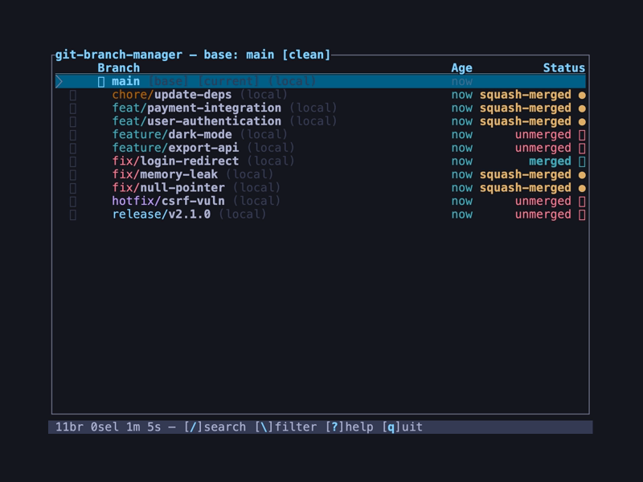
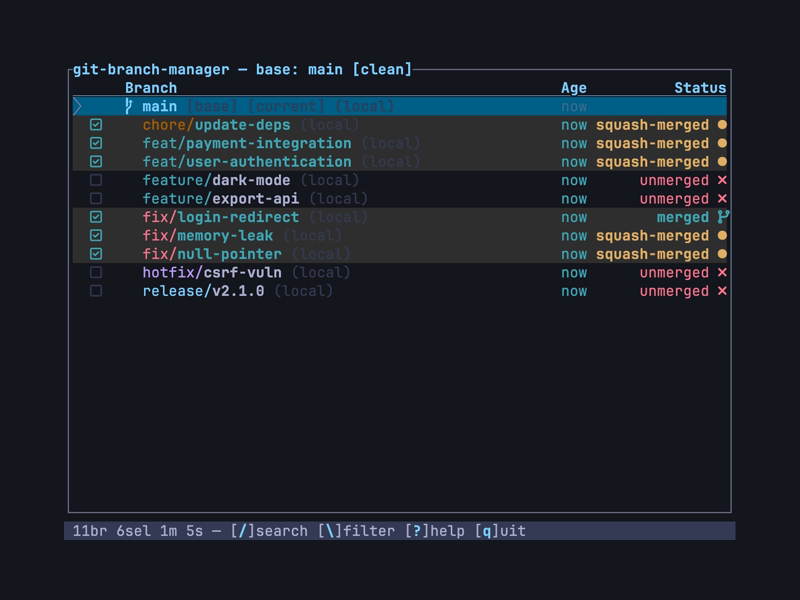
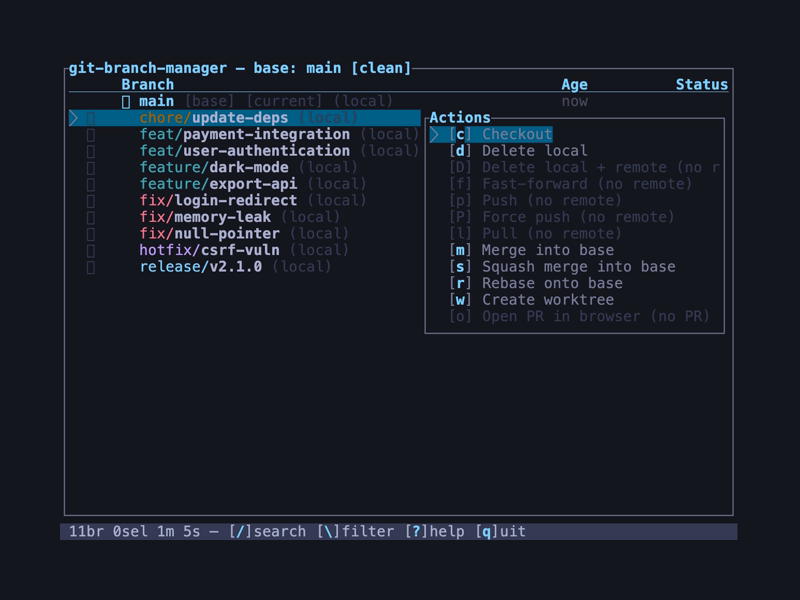
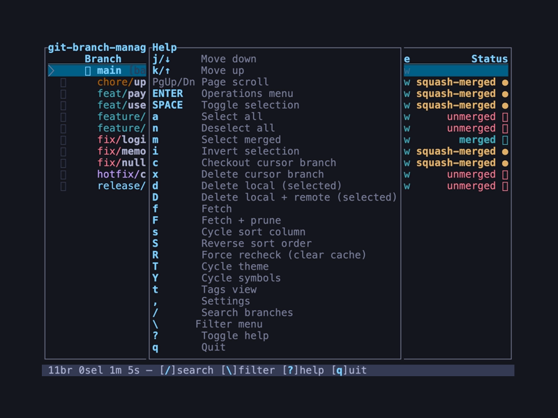

# git-branch-manager

Interactive TUI for managing local git branches with squash-merge detection.

Ever accumulate dozens of local branches that GitHub says were "squash and merged" but `git branch -d` refuses to delete because it thinks they're unmerged? This tool fixes that.

## Screenshots

**Branch list** — branch name prefixes are color-coded; merged and squash-merged branches are identified automatically:



**Select merged** — press `m` to select all merged and squash-merged branches, then `d` to delete:



**Context menu** — press `Enter` on any branch for per-branch actions (checkout, delete, push, merge, rebase, and more):



**Help overlay** — press `?` to show all keybindings:



## Quick Start

```sh
cargo install --path .
cd your-repo
git branch-manager
```

## Features

- **Squash-merge detection** — identifies branches that were squash-merged into the base branch, even though git considers them unmerged
- **Regular merge detection** — also detects conventionally merged branches
- **Full-screen TUI** — scrollable branch list with merge status, remote tracking info, and branch age
- **Multi-select** — toggle individual branches or use quick-select shortcuts (all, none, merged-only, invert)
- **Batch operations** — delete local branches, or delete local + remote in one action
- **Auto-detect base branch** — reads `origin/HEAD`, falls back to main/master/develop
- **Non-destructive loop** — after an operation, results are shown and the branch list refreshes so you can keep working
- **Graph view** — first tab; commit DAG with live-ref pane, remote overlay, and automatic Git-CLI fallback

## Graph View

Graph is the first tab and the default view on launch. Each row streams the commit DAG (topology, abbreviated OID, summary) on the left alongside a responsive `LRT │ State │ Refs` pane on the right. The pane and the DAG share one cursor and scroll offset — there is no independent pane focus yet.

Press `o` to open Graph options. `Space` toggles "Include remote refs", and `Enter` applies the toggle and reloads. The remote-ref preference **persists** to `config.toml` (only the history-window size does not persist across restarts).

Press `L` to load 500 more commits per press; history expansion is uncapped and session-only.

Press `Enter` on a commit to open the same branch/remote/tag context menu used by the Branches, Remotes, and Tags views, built from whatever live refs point at that commit. Commits with no matching refs are shown informationally with no actions.

Graph loads via the Gleisbau graph-layout crate first. If Gleisbau errors or panics (e.g. on shallow clones or unusual ref states), Graph falls back to `git log --graph --topo-order --decorate` and shows a "Git fallback: \<cause\>" banner.

## Usage

```sh
# Run in any git repo (auto-detects base branch)
git branch-manager

# Override the base branch
git branch-manager --base develop

# Non-interactive dumps: print a fully-enriched view to stdout and exit
git branch-manager --branches          # branch list (equivalent to --list)
git branch-manager --remotes           # remote-tracking branches
git branch-manager --tags              # tags
git branch-manager --worktrees         # worktrees

# Run against a repo at a specific path (defaults to current directory)
git branch-manager --repo /path/to/repo --branches

# Control ANSI color in dump output (default: auto-detect TTY)
git branch-manager --branches --color always   # force color (e.g. for less -R)
git branch-manager --branches --color never    # strip color (stable diffs)

# --list is a deprecated alias for --branches
git branch-manager --list
```

## Keybindings

### Graph

| Key | Action |
|-----|--------|
| `j` / `↓` | Move cursor down |
| `k` / `↑` | Move cursor up |
| `h` / `l` / `←` / `→` | Scroll commit text and refs |
| `g` / `G` | Home / End |
| `PgUp` / `PgDn` | Page scroll |
| `Enter` | Open action menu for commit's refs |
| `o` | Open Graph options |
| `L` | Load 500 older commits |
| `r` | Reload graph |

### Branch List

| Key | Action |
|-----|--------|
| `j` / `↓` | Move cursor down |
| `k` / `↑` | Move cursor up |
| `Space` | Toggle selection on current branch |
| `a` | Select all (except base and current branch) |
| `n` | Deselect all |
| `m` | Select merged + squash-merged branches |
| `i` | Invert selection |
| `d` | Delete selected branches (local only) |
| `D` | Delete selected branches (local + remote) |
| `?` | Show help overlay |
| `q` / `Esc` | Quit |

### Confirmation

| Key | Action |
|-----|--------|
| `y` | Confirm and execute |
| `n` / `Esc` | Cancel, return to branch list |

### Results

| Key | Action |
|-----|--------|
| Any key | Return to branch list (refreshed) |

## How Squash-Merge Detection Works

When a branch is squash-merged via GitHub (or similar), git creates a new single commit on the base branch. The original branch commits are not ancestors of this new commit, so `git branch --merged` reports the branch as unmerged.

This tool detects squash merges by:

1. Finding the common ancestor between the base branch and the feature branch
2. Creating a temporary commit that squashes all feature branch changes onto that ancestor
3. Using `git cherry` to check if equivalent content already exists in the base branch

If the content matches, the branch is marked as **squash-merged**.

## Building

Requires Rust (stable). Install via [rustup](https://rustup.rs/).

```sh
# Build
cargo build

# Build release
cargo build --release

# Run tests
cargo test -- --test-threads=1

# Lint
cargo clippy
```

Tests require `--test-threads=1` because the squash-merge detection tests use `set_current_dir` which is process-global.

## License

MIT
