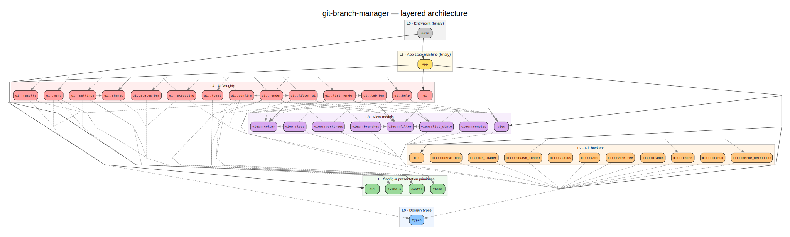

# Architecture diagram



A layered view of the crate's modules and their dependencies, generated from the
real `use` graph by [`cargo-modules`](https://github.com/regexident/cargo-modules)
— not hand-drawn, so it stays accurate.

## Regenerate

```sh
./scripts/gen-arch-diagram.sh
```

Requires `cargo-modules` (`cargo install cargo-modules`) and Graphviz
(`brew install graphviz`). Re-run whenever the module structure changes.

## Layers (top → bottom; arrows = "depends on")

| Layer | Contents |
|-------|----------|
| L6 Entrypoint | `main` — CLI parse, terminal setup, launch |
| L5 App state machine | `app` — event loop, view state, background receivers |
| L4 UI widgets | `ui::*` — ratatui rendering (render, list_render, overlays, bars) |
| L3 View models | `view::*` — column defs, list state, filtering per view |
| L2 Git backend | `git::*` — branch/tag/worktree listing, merge detection, operations |
| L1 Config & presentation | `config`, `theme`, `symbols`, `cli` |
| L0 Domain types | `types` — shared domain models, the dependency sink |

## How it's built

`scripts/gen-arch-diagram.sh` runs three stages:

1. `cargo modules dependencies --lib …` → `modules.dot` (raw module graph).
2. `scripts/layer_dot.py` buckets each module into a layer, keeps only
   dependency (`uses`) edges, and emits clustered `architecture.dot`.
3. Graphviz `dot` renders `architecture.svg` / `architecture.png`.

**Note on `app` / `main`:** these live in the *binary* crate, which cargo-modules
analyzes separately from the library (it sees the lib as one opaque extern), so
their edges into individual lib modules aren't machine-derivable. They're added
by `layer_dot.py` as a labeled binary-shell top layer from source inspection;
everything in L0–L4 is fully tool-derived.
